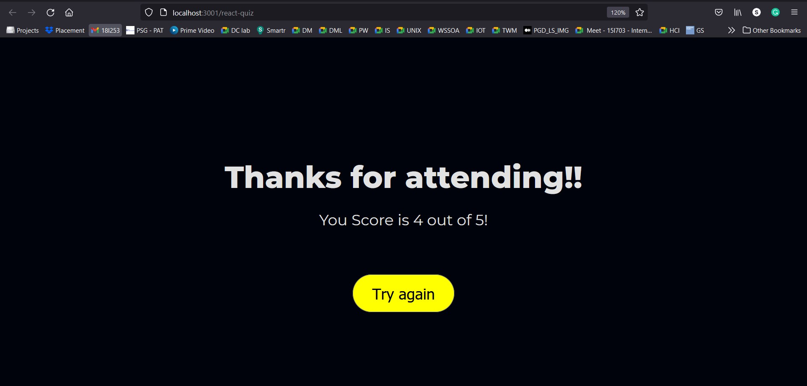

<div align="center">
<h2>Quiz App</h2>

 
  
  
</div>

## Introduction
Responsive Quiz App made with React, [Open Trivia DB](https://opentdb.com/) and styled-components.


# Live Demo

Check out the demo [here](https://aykutsarac.github.io/react-quiz/)

## Installation
- Install dependencies
```
$ npm install
```
- Run it
```
$ npm start
```

## **License**

This project is licensed under the [MIT License](https://opensource.org/licenses/MIT) - see the [`LICENSE`](https://github.com/AykutSarac/react-quiz/blob/master/LICENSE) file for details.
